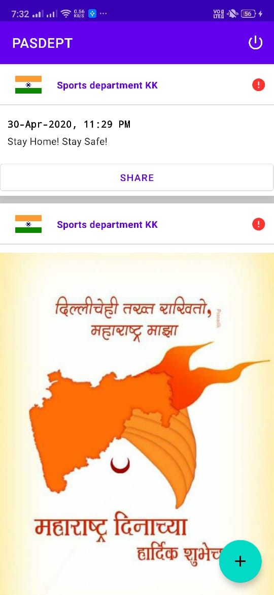
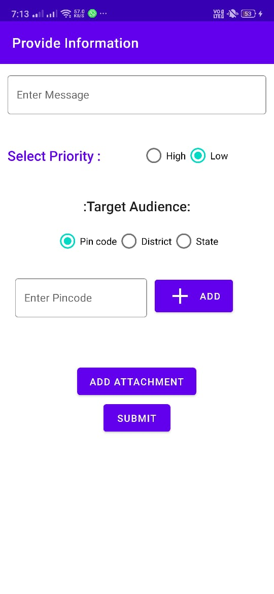

# PASDEPT

PAS Department application

<b>Complete code available under branch "Final_commit"</b>

PAS department application allows authorized department personnels to upload post to the application. Post can contain message, priority, attachments and region(pincodes, district or state).

1) Registration : 

Department personnel can register using Email-ID, Department ID and Department Name. 
Once registered, request goes to admin for approval. Department personnel won't be able to login unless admin approves the registration request.(Currently done through database directly.)

2) Home: 

Once signed In, department personnel can view all the posts from generated by their department.

3) Add post:

Department personnel can add post with message, attachments, pincode, district, state, priority etc.

